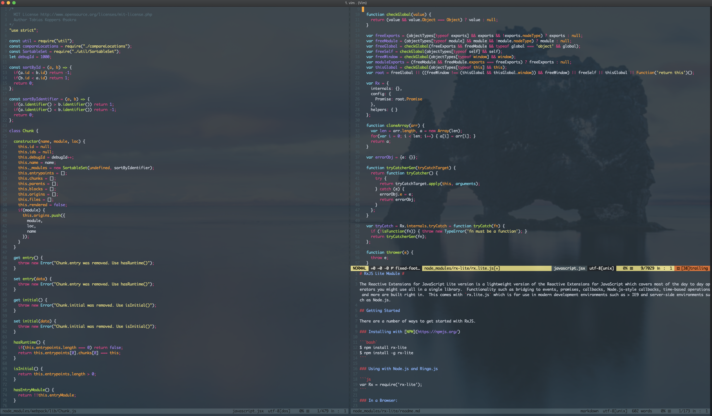

# 🗃 Dotfiles 

#### Hey Specificity, this is how you set up your new Mac ✨🖥 for development 💼

---

### 📋 To get started, download and install the following

- ⌨️ [iTerm](https://www.iterm2.com/downloads.html)
  - Download and import the [Monokai Remastered](https://raw.githubusercontent.com/mbadolato/iTerm2-Color-Schemes/master/schemes/Monokai%20Remastered.itermcolors) color scheme
  - On Appearance
    - On General
      - Set theme to `minimal`
    - On Tabs
      - Disable `Stretch tabs to fill bar`
    - On Panes
      - Disable `Show per-pane title bar with split panes`
  - On Profiles
    - For the Default one
      - Set transparency to ~45%
      - Set blur to ~12%
    - Create a new one called Vim
        - Set shortcut key to ⌃⌘ + V
        - Set transparency to ~10%
  - On Keys
    - Set `next pane` shortcut to ⌃⌥ + L
    - Set `prev pane` shortcut to ⌃⌥ + H

- 💅 [oh-my-zsh](https://github.com/robbyrussell/oh-my-zsh) 

- 📦 [Vim Plug](https://github.com/junegunn/vim-plug)

- 🍺 [Homebrew](https://brew.sh/)

- 🥈🔍 `brew install the_silver_searcher`

- 🎧 💻 `brew install macvim` (however, you've been oftern using plain Vim nowadays)

### Then

- Create an [ssh-key](https://help.github.com/en/enterprise/2.15/user/articles/generating-a-new-ssh-key-and-adding-it-to-the-ssh-agent)
- Add it to [Github](https://help.github.com/en/enterprise/2.15/user/articles/adding-a-new-ssh-key-to-your-github-account)
- 🖨 Clone the repo

- Symlink in home directory (`ln -sf /path/to/file /path/to/symlink`) 🏠 📂:
  - `.gitignore_global`
  - `.gitconfig`
  - `.vimrc`
  - `.zshrc`
  - `~/.oh-my-zsh/themes/robbyrussel.robbyrussell.zsh-theme`
  - `~/.vim/plugins.vim`
  
  
### The end result 🚀

